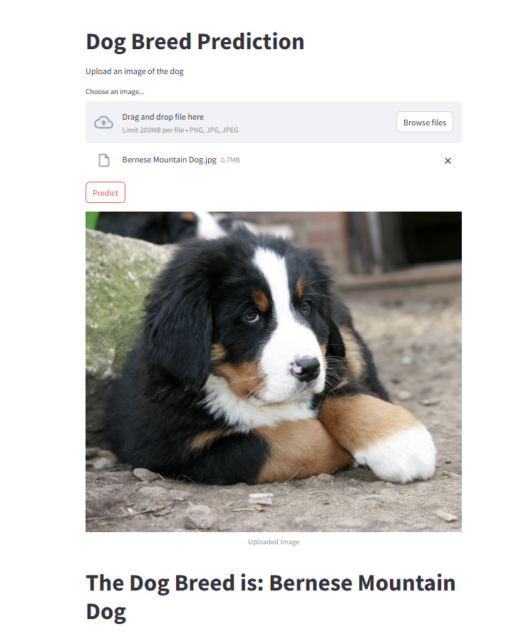

# Dog Breed Prediction App

## Overview
The **Dog Breed Prediction App** is a Streamlit-based web application that allows users to upload an image of a dog and receive an AI-powered prediction of the dog's breed. The app leverages deep learning and computer vision techniques to classify dog breeds accurately.

## Features
- Upload an image of a dog.
- Receive a predicted dog breed using a deep learning model.
- View confidence scores for the top predicted breeds.
- Simple and interactive user interface powered by Streamlit.

## Dataset
The model is trained on a dataset of various dog breeds, likely sourced from **Stanford Dogs Dataset** or similar datasets. The images are preprocessed and fed into a convolutional neural network (CNN) for classification.

## Technologies Used
- **Python**
- **Streamlit** (for web app interface)
- **TensorFlow / Keras** (for deep learning model)
- **OpenCV** (for image preprocessing)
- **NumPy** (for data handling)

## Installation
To run the app locally, follow these steps:

```bash
# Clone the repository
git clone https://github.com/yourusername/dog-breed-predictor.git
cd dog-breed-predictor

# Create a virtual environment (optional but recommended)
python -m venv venv
source venv/bin/activate  # On Windows: venv\Scripts\activate

# Install dependencies
pip install -r requirements.txt
```

## Running the App
After installing dependencies, launch the Streamlit app using:

```bash
streamlit run app.py
```

This will start the web app, and a browser window should open automatically.

## Usage
1. Open the app in your browser.
2. Click the "Upload Image" button and select a dog image.
3. Wait for the model to process the image.
4. View the predicted breed.

## Model Details
The deep learning model is based on a **Convolutional Neural Network (CNN)**. The architecture is as follows:

- **Conv2D (64 filters, 5x5, ReLU) + MaxPooling2D**
- **Conv2D (32 filters, 3x3, ReLU, L2 regularization) + MaxPooling2D**
- **Conv2D (16 filters, 7x7, ReLU, L2 regularization) + MaxPooling2D**
- **Conv2D (8 filters, 5x5, ReLU, L2 regularization) + MaxPooling2D**
- **Flatten + Dense (128, ReLU, L2 regularization)**
- **Dense (64, ReLU, L2 regularization)**
- **Dense (softmax output layer)**

The model is compiled using **categorical crossentropy loss** and **Adam optimizer (learning rate = 0.0001)**.

## File Structure
```
├── images/
│   └── inference.png              # Sample inference image
├── research/
│   └── Dog_Breed_Prediction.ipynb # Jupyter Notebook for model training
├── app.py                         # Streamlit app script
├── dog_breed.h5                   # Trained model file
├── requirements.txt               # Required dependencies
├── README.md                      # Project documentation

```


## Example Inference

Below is an example of the dog breed prediction inference:

